  

  
  
  
   
  
  

## About

I build products and scientific software: Co-Founder & CTO at **MacroGlide**, and a Chemistry + Computer Science student at **Boston University** doing research in computational chemistry and biology.

  

Open to conversations about computational chemistry, AI-driven drug discovery, scientific computing, and working with MacroGlide.

## Scientific software

Projects, figures, benchmarks and demos are on [tirizvanov.github.io](https://tirizvanov.github.io/).

## Activity

  

  <picture>
    <source media="(prefers-color-scheme: dark)" srcset="https://raw.githubusercontent.com/TiRizvanov/TiRizvanov/output/snake-dark.svg">
    <source media="(prefers-color-scheme: light)" srcset="https://raw.githubusercontent.com/TiRizvanov/TiRizvanov/output/snake.svg">
    
  </picture>

  

